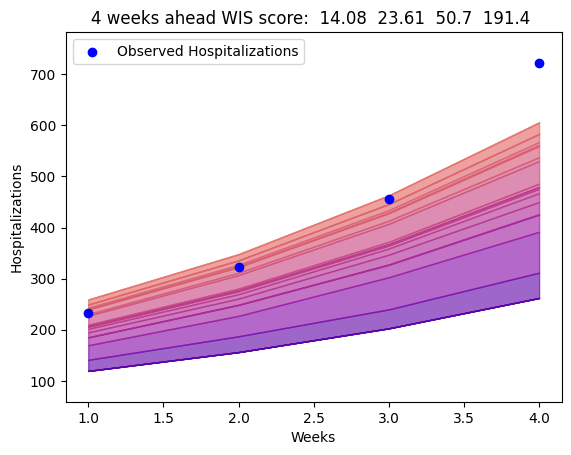

# Determing Accuracy for Flu Forecasting

This project aims to determine the forecasting accuracy for various disease prediction methods.

We are currently using MCMC and Particle Filter algorithms to predict the future flu hospitalization rates, based on past hospitalization data. 

These algorithms make predictions for hospitalization rates up to 4 weeks into the future.

We want to compare the forecasting accuracy between these prediction methods. 

## How can we determine accuracy? 

We are utilizing a Weighted Interval Score (WIS) outlined in the following paper: 

https://www.ncbi.nlm.nih.gov/pmc/articles/PMC7880475/

## WIS Visualization

The following plot is an example of a single week's prediction scores for Arizona. Note that lower scores are better. So, a score of 0 would indicate a perfect prediction with no uncertainty. A wider quantile range indicates more uncertainty in the predictions. 

Notice that the scores increase as the prediction time increases. This is expected --- it is easier to predict 1 week into the future versus 4 weeks into the future.

